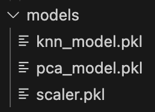
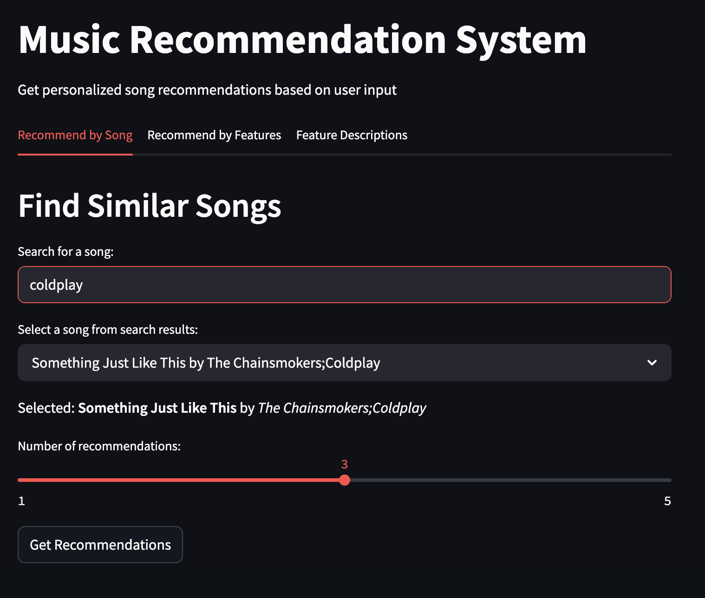
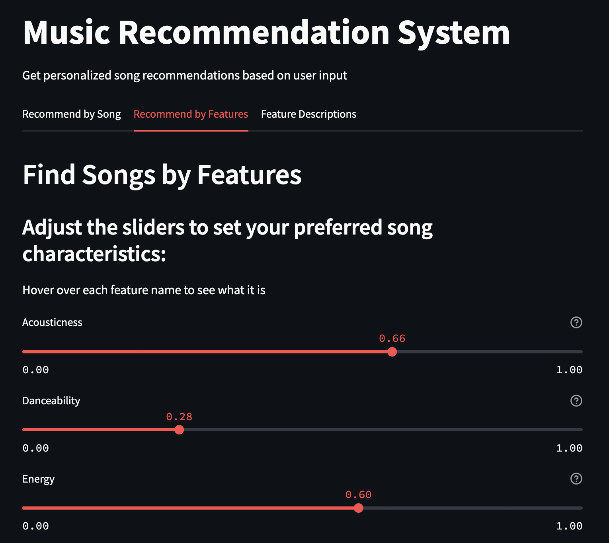
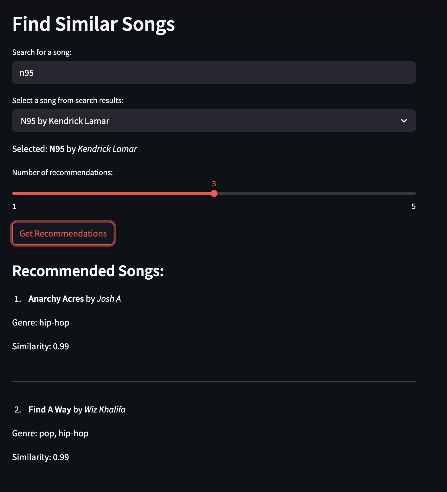

# Spotify Recommender

## Description

Spotify heavily relies on collaborative filtering to make recommendations, which is the practice of cross-referencing their users' listening patterns and making recommendations based on overlap between persons or groups. What this app aims to do is to take the counterpart, content filtering, which is the process of making recommendations based solely on the features of the music itself, and see how well a recommender system can do on that alone. This is a project for Mac systems that uses an app in Streamlit to make recommendations.

## Data

The data used is publicly available on Kaggle:
- [Spotify Tracks DB](https://www.kaggle.com/datasets/zaheenhamidani/ultimate-spotify-tracks-db/data)
- [Spotify Tracks Dataset](https://www.kaggle.com/datasets/maharshipandya/-spotify-tracks-dataset?resource=download)

The requirements for valid datasets were that both datasets had track IDs and track genres. Also, while not using the Spotify API in this project, the datasets had to pull their musical data from the Spotify API in order to have standardization of musical features.

## Running the Project

In order to run the project, download the project folder SpotifyRecommender and run the setup script with "python3 setup.py". Follow the instructions provided by the setup script for further steps (such as setting up virtual environment, running the pipeline, and running the Streamlit app).

Running the pipeline executes the project structure: Data preprocessing -> Feature engineering -> Genre classification model training

Data preprocessing: 
- Combining datasets
- Removing duplicates
- Removing unnecessary genres
- Scaling the data

Feature engineering:
- PCA

Genre classification model training:
- KNN with adjustments for multi-class
- Validation using Cross-validation and ROC

All created models in this pipeline (StandardScaler, PCA, KNN) are saved as pickle objects in SpotifyRecommender/models for reuse in the Streamlit app.

Example:
```python
#Scale features
print("Scaling features...")
scaled_df, scaler = dp.scale(processed_df, features)
print(f"Scaled dataset shape: {scaled_df.shape}")
      
#Save scaler so it can be reused each time we open the Streamlit app
scaler_filename = 'models/scaler.pkl'
pickle.dump(scaler, open(scaler_filename, 'wb'))
print(f"Scaler saved to {scaler_filename}")
```


## Recommender System

The first recommendation option in the app allows the user to search for a song of their choice. The recommender system grabs the musical features of that song and compares it to all other songs.

```python
def compute_song_similarity(self, track_id, n_recommendations):
    #Compute cosine similarity matrix for n songs
    song = self.pca_df[self.pca_df['track_id'] == track_id]
      
    if len(song) == 0:
        return "Track not found in the dataset."
      
    #Get song's data for the targeted features and find similarity between all the other songs
    song_pca_features = song[self.pca_features].values
    similarities = cosine_similarity(song_pca_features, self.pca_df[self.pca_features])[0]
      
    #Give them indices
    similarity_scores = list(enumerate(similarities))
      
    #Sort the recommendations excluding the input song itself
    similarity_scores = sorted(similarity_scores, key=lambda x: x[1], reverse=True)
    similarity_scores = similarity_scores[1:n_recommendations + 1]
      
    #Get recommendations
    song_indices = [i[0] for i in similarity_scores]
    recommendations = self.pca_df.iloc[song_indices][['track_name', 'artist_name', 'genre']]
    recommendations['similarity_score'] = [i[1] for i in similarity_scores]
      
    return recommendations   
```



The second option allows a user to arbitrarily decide the type of qualities they prefer in a song, and the recommender system will provide the closest matches to those musical features

```python
def recommend_by_features(self, feature_values, n_recommendations):
    """
    Recommend songs based on user-specified feature values
    """
    #Create a feature vector from the user inputs
    filled_feature_values = []
      
    for feature in self.features:
        if feature in feature_values:
            filled_feature_values.append(feature_values[feature])
        else:
            #Use median value if not specified
            filled_feature_values.append(self.df[feature].median())
      
    #Reshape and scale
    filled_feature_values = np.array(filled_feature_values).reshape(1, -1)
    scaled_features = self.scaler.transform(filled_feature_values)
      
    #Transform to PCA space and calculate similarity
    pca_features = self.pca_model.transform(scaled_features)
    similarities = cosine_similarity(pca_features, self.pca_df[self.pca_features])[0]
      
    #Add similarity scores and get recommendations
    temp_df = self.pca_df.copy()
    temp_df['similarity'] = similarities
    recommendations = temp_df.sort_values('similarity', ascending=False).head(n_recommendations)
      
    return recommendations[['track_name', 'artist_name', 'genre', 'similarity']]
```



Recommendations are made using cosine similarity and finding the n most similar songs to the song or set of musical features inputted by the user.


